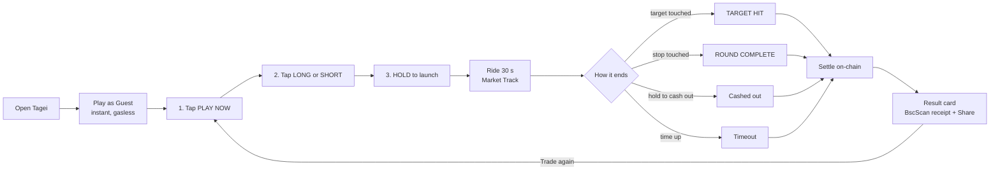
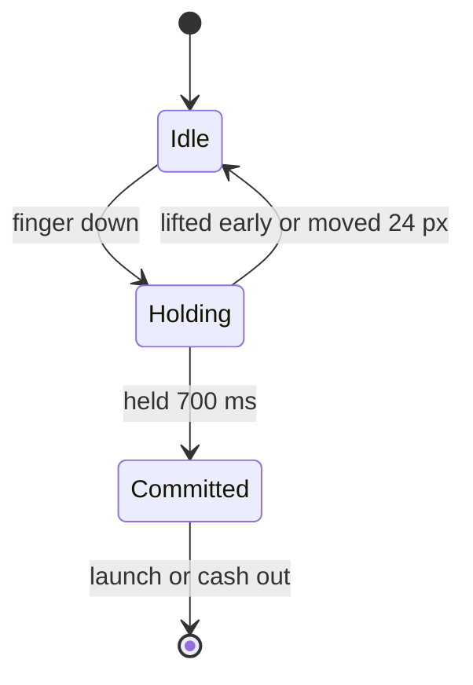
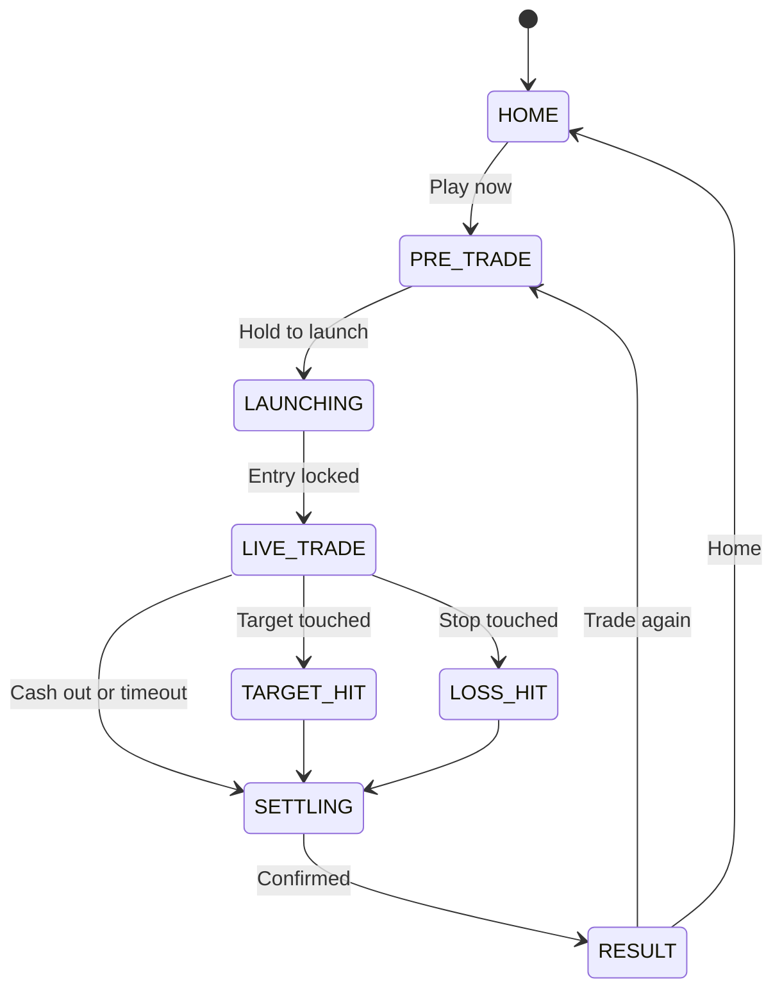
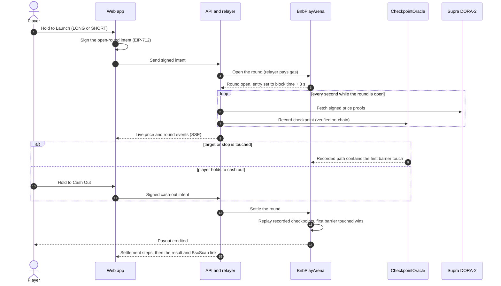
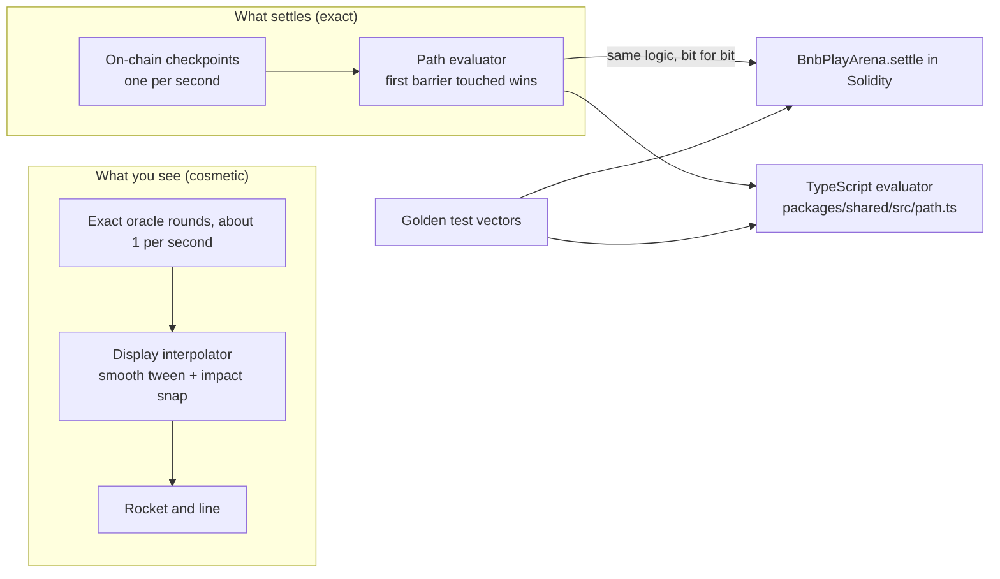
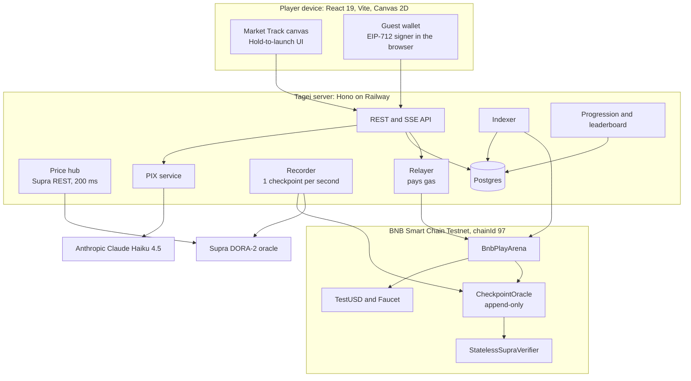

# Tagei: Ride the Market

> **Pick a side. Hold. Ride.**
> Live markets, played like a game, settled on BNB Chain.

Tagei turns a live crypto price into a rocket you can ride for 30 seconds. You choose LONG or SHORT, **hold** to launch, and watch the rocket follow the real market until it hits a target, hits a stop, you cash out, or time runs out. Every round settles on **BNB Smart Chain** from oracle prices recorded on-chain, so every result comes with a receipt.

| | |
|---|---|
| **Chain** | BNB Smart Chain Testnet (chainId 97). Valueless test tokens only. |
| **Oracle** | Supra DORA-2, one checkpoint recorded on-chain per second |
| **Round** | 30 seconds, LONG or SHORT, stake 5 to 50 tUSD (default 10) |
| **Markets** | BNB, BTC, ETH, SOL, DOGE |
| **Gesture** | Press and hold. That is the whole trade. |
| **Wallet** | *Play as Guest* (instant, gasless) or a browser wallet |
| **Stack** | React 19, Vite, Canvas 2D, Hono, Postgres, Solidity (Foundry), Supra DORA-2 |

---

## 1. The 3-touch trade

The goal was to make a trade feel like launching something, not filling in a form. Asset, stake and tier all have sensible defaults, so the only real decision is direction.



| Decision | Default | Need to choose? |
|---|---|---|
| Market | BNB | No, swipe the track or tap the ticker to change |
| Stake | 10 tUSD | No, chips for 5, 25 and 50 and a stepper |
| Tier | CRUISE 1.5x | No |
| **Direction** | none | **Yes, one tap** |
| **Launch** | n/a | **Yes, one hold** |

The launch button stays disabled and reads **SELECT LONG OR SHORT** until a direction is picked, so it cannot be fired half-configured.

---

## 2. One gesture, done properly

A hold is easy to say and easy to get wrong. These are the details behind it.

- **Hold to Launch and Hold to Cash Out** are the only two money actions, and both use the same gesture.
- **700 ms hold on touch**, with a progress ring and a **haptic tick at each quarter**. It is long enough that a thumb stretching across the screen cannot trigger it, and short enough to feel instant.
- **Slide-off cancels.** Moving the finger more than 24 px cancels the hold, so there is a clean way out.
- **Mouse and keyboard commit immediately.** Holding a mouse button is not a desktop habit, so a click (or Enter / Space) is enough.
- **Thumb side setting.** LEFT or RIGHT mirrors the thumb-edge UI for left-handed players.
- **Accessibility.** Tap targets are at least 44 px, direction is never shown by colour alone (icon plus label), there is a reduced-motion switch, and sound is **off by default**.



---

## 3. A round, end to end

### Screen flow

The game runs as a small state machine, so every screen has one obvious next move.



### What happens on-chain



**Fairness by construction.** The entry price is fixed **3 seconds after** the player commits, so nobody (including the operator) knows the entry price when you press hold.

### Payout model

| Outcome | Payout |
|---|---|
| Target touched first | `stake x multiplier` |
| Stop touched first | `0` |
| Neither touched (cash-out or timeout) | Proportional to where the price ended, minus a **1% fee** |
| Oracle data missing or invalid | **Void: the full stake is returned** |

The multiplier is a **payout multiplier, not leverage**. There is no liquidation. The most you can lose is the stake you chose, which is capped at 50 tUSD. Tiers: **CRUISE 1.5x** and **BOOST 2x** are playable now; **HYPER 3x** and **WARP 5x** are built but switched off until the lane economics are validated.

---

## 4. The Market Track: the market is the interface

Most trading apps put a chart on screen and ask you to interpret it. In Tagei the **rocket is the chart**.

- The glowing line is a smoothed rendering of the real price. The rocket's height and angle come straight from it.
- Target and stop appear as simple zones (**Profit Zone**, **Stop Zone**) with one live P&L number.
- The track is drawn procedurally on a Canvas 2D surface (no sprite sheets). The rocket, exhaust, coins and hit effects are all code.
- Direction is never inverted for SHORT. The track always shows the real market and the outcome is calculated the other way round.
- The visuals are **display only**. Smoothing and impact effects never affect settlement (see section 5).

---

## 5. Provable settlement

This is the part that makes Tagei a game you can trust.



1. **Recorded, not trusted.** A recorder submits Supra DORA-2 proofs for every second a round is open. A *stateless* verifier checks the Supra committee signature and a Merkle multiproof on-chain, so even historical seconds are provable. The checkpoints are written to an **append-only** `CheckpointOracle`.
2. **Replayed, not recalculated.** At settlement the contract replays the recorded path. The first barrier touched wins.
3. **One evaluator, two languages.** The path evaluator exists in TypeScript and Solidity. A differential test feeds both the same golden vectors and requires identical results.
4. **Exact checkpoints only.** Settlement and P&L never use the smoothed display price.
5. **Fail safe.** If data is missing for more than 60 seconds after the round ends, or a checkpoint is invalid, the round is **voided and the stake is refunded**.
6. **A ledger that must balance.** The contract keeps an invariant that its token balance always equals players + house + locked stakes + surplus, and fuzz and invariant tests enforce it.

### Deployed contracts (BNB Smart Chain Testnet, chainId 97)

| Contract | Address |
|---|---|
| BnbPlayArena | [`0x8F1E4A377372E7E1d9fb10185c4bb038cF54e439`](https://testnet.bscscan.com/address/0x8F1E4A377372E7E1d9fb10185c4bb038cF54e439) |
| CheckpointOracle | [`0xcFA4634C911F8b713e50086Ef6a332C87c2a4010`](https://testnet.bscscan.com/address/0xcFA4634C911F8b713e50086Ef6a332C87c2a4010) |
| StatelessSupraVerifier | [`0x12789fEcd699Dee6B6032C546270A27500b1ea79`](https://testnet.bscscan.com/address/0x12789fEcd699Dee6B6032C546270A27500b1ea79) |
| TestUSD | [`0x4c0bEdD4C4C4f34c2C6cF02172A66953FDF4eC50`](https://testnet.bscscan.com/address/0x4c0bEdD4C4C4f34c2C6cF02172A66953FDF4eC50) |
| TestUSD Faucet | [`0xc7cEE3515171E06B49E1590b7A8C1d85ac65006C`](https://testnet.bscscan.com/address/0xc7cEE3515171E06B49E1590b7A8C1d85ac65006C) |
| Signed backup oracle (registered, inactive) | [`0x8a8F45aAabB5ca222E3F4C820a6e60E5F0BdF968`](https://testnet.bscscan.com/address/0x8a8F45aAabB5ca222E3F4C820a6e60E5F0BdF968) |

---

## 6. No wallet wall: gasless guest play

New players should reach a rocket, not a wallet install.

- **Play as Guest** creates a key **in the browser**, signs locally, and never asks for gas.
- A **relayer** submits the transactions and pays the gas. Guests sign typed (EIP-712) intents for login, opening a round and cashing out.
- The first session receives a **100 tUSD** drip from the faucet ledger so there is something to play with.
- The key can be exported from the profile. A **browser wallet** (MetaMask, Rabby, Brave and others) works too.

---

## 7. PIX: an AI co-pilot that explains and never predicts

PIX is a small fox who sits above the track.

- It explains what the market is doing in plain words and writes a short **debrief after each round**.
- It has a hard rule: **it explains, it never predicts.** Asked which way the price will go, it says nobody can call it.
- An output filter blocks promise language ("guaranteed", "can't lose", "all-in", "buy now") and falls back to safe templates if anything slips through.
- It never suggests stake sizes and never talks about "winning it back".
- It is rate limited per player per day and has a budget kill-switch, so cost stays predictable.
- It runs on Anthropic Claude Haiku 4.5 and falls back to templates when no key is configured.

---

## 8. Progression and responsible play

Tagei is designed to bring people back for the game, not for a loss they want to undo.

- **XP never scales with stake.** It rewards finishing a flight, hitting a target, disciplined exits and reviewing a debrief, so betting more earns nothing extra.
- **Daily goal and streak.** "Fly 3 rounds" is the daily goal; a streak adds a small bonus. After 30 rounds in a UTC day, XP is halved, then stops, so grinding does not pay.
- **Levels and badges.** Cadet up to Orbit Legend, plus badges such as First Orbit and Iron Discipline.
- **Leaderboard ranks XP**, weekly and all-time, with no P&L and no win rate, so size cannot buy rank.
- **Hard rules in the product:** no auto-raised stakes, no loss-streak bonuses, no faucet refill offered on a loss screen, no "you lost" or "win it back" copy, and a status line that reads *round complete*, not *failed*.
- **Practice mode** (mock market, not on-chain) earns no XP and is clearly labelled.

---

## 9. Architecture



| Layer | Technology |
|---|---|
| Web app | React 19, Vite 6, Tailwind 4, `motion`, wagmi and viem, zod, TanStack Query |
| Rendering | Canvas 2D, procedural rocket, track and particles |
| Live data | One Server-Sent Events stream with replay (`Last-Event-ID`), about 1 price update per second per asset |
| API | Hono on Node, zod-validated, EIP-712 login to a 24 h JWT |
| Database | Postgres with Drizzle (21 tables) |
| Contracts | Solidity 0.8.30, Foundry |
| Oracle | Supra DORA-2 (pull proxy and committee verifier on BSC testnet) |
| Hosting | Vercel (web), Railway (server) |
| Monorepo | pnpm workspaces: the web app (root), `server`, `packages/shared` |

---

## 10. Quality

- **Contracts:** 100+ Foundry tests covering unit, fuzz, invariant, differential (against the shared golden vectors) and fork cases, plus an **internal contract security review** (verdict: pass with fixes).
- **TypeScript:** 250+ tests across the web app, server and shared package.
- **CI:** typecheck, tests, vector consistency check, build and `forge test` on every push.
- **Oracle spike:** a 60-minute recording found a Supra round for every second on all five pairs, with the first sighting of each at a median of about 0.4 s.

---

## 11. Marketing and growth built into the product

- **A result worth sharing.** The result screen has a one-tap **Share on X** and a BscScan receipt link. Link previews use Open Graph and Twitter Card tags.
- **A clear brand voice.** Calm and specific, never hype. Lead with the mechanism, never frame a loss as failure.
- **Short, repeatable lines:** *Pick a side. Hold. Ride.* / *Every result comes with a receipt.* / *The market is the game.*
- **An anthem and a music video.** *Ride the Market* is a full song with a 2 minute 27 second motion-graphics video built from real gameplay captures.
- **Retention without chasing.** Daily goal, streak, levels and an XP leaderboard give people a reason to return that has nothing to do with winning money back.

---

## 12. Honest status

**Working in the repo**

- Full game loop on BNB Smart Chain Testnet: guest sign-in, open, ride, cash-out, settle, result.
- Contracts deployed on testnet with an oracle recorder, stateless Supra verification and a settlement path that mirrors the shared evaluator.
- Server with REST and SSE, Postgres, relayer, recorder, indexer, progression and leaderboard.
- Web app with the Market Track, PIX chat and debriefs, profile, settings, leaderboard and share.
- **Practice mode** (mock price feed, no chain, no XP) for trying the game without the backend.

**Deliberately not switched on yet**

- **HYPER and WARP tiers** are built but disabled until the economics are validated.
- **Real value.** Tagei is testnet only. `TestUSD` has no value and every key in the repo is a burner.

**Roadmap** (planned, not delivered)

- Enable higher tiers once lane economics are validated, with lanes that adapt to volatility.
- Harden for mainnet: multisig and timelock for admin roles, and a second recorder and oracle path (a signed backup oracle is already deployed and registered, but inactive).
- More markets beyond the five crypto assets.
- Deeper quests, seasons and shareable result cards.

### Trust model and known limitations

We would rather you hear these from us.

- **The operator is trusted for liveness.** One server records checkpoints. It cannot change a recorded price, but it could fail to record, which voids the round and refunds the stake.
- **Admin keys exist.** On testnet one deployer key holds the admin roles with no timelock. A mainnet launch would require a multisig and timelock.
- **Oracle latency.** Supra can lag a centralised exchange by a second or two. An informed player could exploit that against a market maker, which is a known and accepted risk for a testnet demo and a named item to fix before mainnet.
- **Guest keys live in the browser.** They are not encrypted at rest, so export the key from the profile if you want to keep an account.
- **Internal review, not an external audit.**

---

## 13. Try it

```bash
pnpm i
pnpm dev            # web app on http://localhost:3000
pnpm dev:server     # API on http://localhost:8787
pnpm typecheck:all
pnpm test:all
cd contracts && forge test
```

**Quickest path for a judge:** open the app, tap **Play as Guest**, tap **Play now**, tap **LONG**, and **hold the pink button**. Watch the rocket, then open the BscScan link on the result screen.

| | |
|---|---|
| **Repository** | https://github.com/Vamp-Labs/Tagei |
| **Live app** | https://bnb-play.vercel.app |
| **Music video** | *Ride the Market*, 2:27 |
